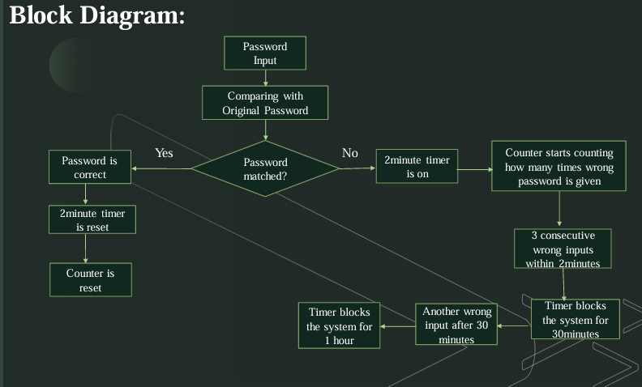

# Password-Based-Door-Lock-System.

Hardware-based password lock using an 8-bit comparator (IC 7485). Tracks failed attempts with IC 4017, enforces timed lockouts (30 min, then 1 hr) via 555 timer, and auto-resets after success or timeout—providing robust, secure access control.

Password-Based Door Lock System

A hardware-based password lock system designed using an 8-bit comparator (IC 7485) to verify user input against a stored password. The system enhances security by tracking incorrect attempts and enforcing timed lockouts.

Key Features

Password verification using IC 7485

Failed-attempt tracking via IC 4017 counter

Time-based lockouts using 555 timer

Auto-reset on successful authentication or timeout

Escalating security: 30-minute and 1-hour lock blocks

Block Diagram

Working Overview

Correct password → system unlocks and resets timers/counters

Wrong password → attempts counted within a time window

Multiple consecutive failures → system temporarily locked

Continued failures → extended lockout for enhanced security

Application

Suitable for secure access control in doors, lockers, and embedded hardware systems.
